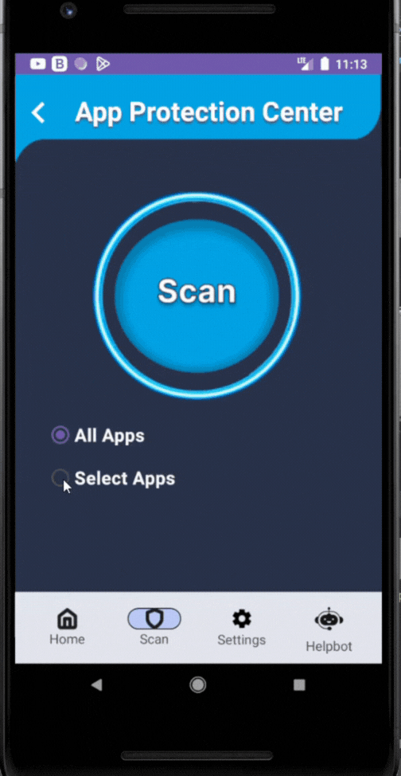
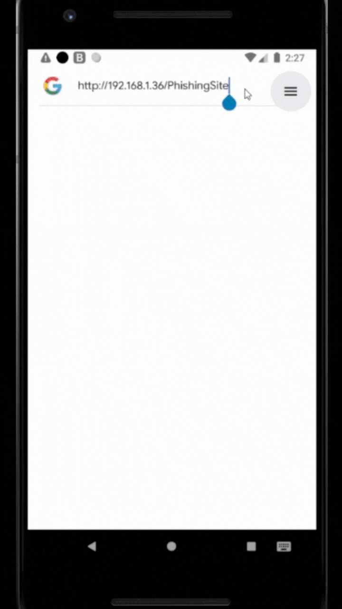
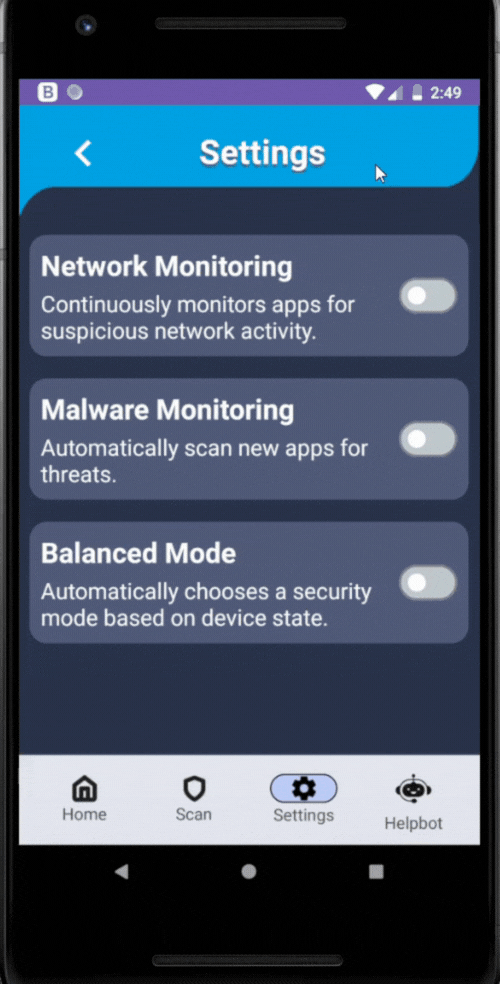
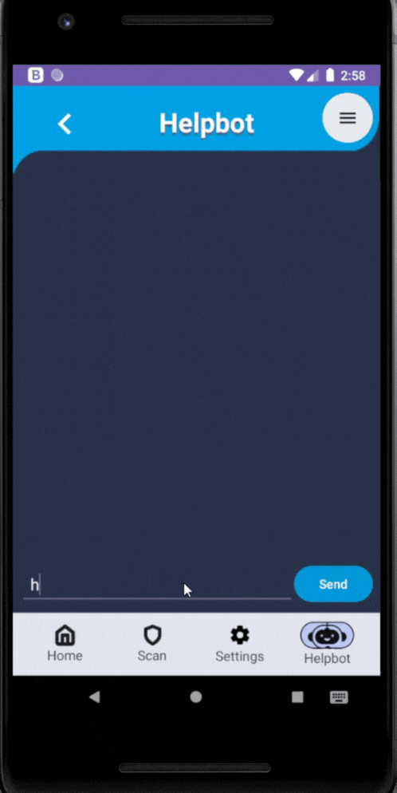

# Patronus: AI-Powered Anti-Malware and Application-Level Network Threat Detection System for Android Devices

## Overview
Patronus is an Android security application developed as a graduation project at Alexandria University. It leverages AI to detect malware based on permission patterns and contextual behavior, while also monitoring network activity at the app level. The system is designed to run efficiently on physical Android devices without root access or elevated privileges.

## Project Thesis
🔗 [Click here](./Thesis.pdf) to read a comprehensive documentation of our methodology, malware profiling, neural network design, evaluation metrics, and system architecture.  
- **Chapter 1:** Introduction, problem statement, objectives, and contributions.
- **Chapter 2:** Background on Android security, malware types, and a comparative analysis of similar security applications.
- **Chapter 3:** Methodology, datasets, feature engineering, and AI model details.
- **Chapter 4:** System design, architecture, detailed component workflows, user interface designs, activity flow and use case diagrams.
- **Chapter 5:** Conclusion, insights, and future enhancements.
- **Appendix:** Key code snippets and technical implementations.
- **References:** Cited research papers, tools, and datasets.

## Team Members
|  |  |  |  |  |  |
|:---:|:---:|:---:|:---:|:---:|:---:|
| [Nouran Abdelsalam](https://github.com/nouranabdlsalam) | [Aml Kassem](https://github.com/Amlkassem) | [Ranwah Gamal](https://github.com/ranwaasala) | [Menna Allah Ahmed](https://github.com/menna27ahmed) | [Suhaila Adel](https://github.com/Suhaila2Adel) | [John George](https://github.com/johnquriv) |

## Key Features

Patronus is composed of seven core modules that work together to provide comprehensive mobile threat defense:

- **AI-Powered Malware Detection**: Uses permission-based neural networks enriched with behavioral profiles of six Android malware families.
- **Context-Aware Risk Scoring**: Dynamically adjusts threat evaluation based on app category and expected behavior to reduce false positives.
- **IP-Level Threat Monitoring**: Detects malicious app behavior by tracking outbound connections to known bad IPs.
- **Wi-Fi Threat Scanner**: Evaluates Wi-Fi network configurations for security issues and suggests mitigation.
- **Configurable Security Modes:** Three levels of protection (Low, Balanced, High) to suit user preferences for performance and security.
- **Threat Remediation**: Receives malware and network threats and proposes remediation options according to the threat type.
- **Interactive HelpBot**: A built-in assistant powered by an LLM that explains alerts and provides remediation tips.

    

### 🦠 AI-Powered Context-Aware Malware Detection System

- Detects malicious apps based on static permission behavior.
     
- Employs a neural network trained on three diverse malware datasets.
     
- Extracts and encodes permissions into binary feature vectors.
     
- Integrates six malware-type behavior profiles: Adware, Ransomware, Trojan, Spyware, Backdoor, Worm.
     
- Features a context-aware scoring layer to interpret app behavior relative to its category.
     
- Reduces false positives by balancing detection precision and functional expectations.
     
              

  ---
  
### 🌐 App-Level IP Monitoring

- Periodically extracts and inspects outbound connections from each installed app.
      
- Maintains a local database of known malicious IP addresses.
      
- Flags suspicious IP traffic per app, highlighting the responsible process.
      
- Uses a lightweight, permission-respecting foreground service (no root, no VPN).
      
- Displays connection logs and raises alerts only when a known threat is identified.
      
- Offers clear risk classification and actionable remediation suggestions.
     
             

  ---

### 🎛️ Configurable Security Modes

- Three predefined security levels: High Performance, High Security, and Balanced.
      
- **High Performance Mode**
  - No background monitoring for new app installs.
  - This mode is active when malware scanning is turned off.
      
- **High Security Mode**
  -  Activates background activity for monitoring new app installs.
  -  This mode is active when malware monitoring is turned on.
      
- **Balanced Mode**: Automatically switches between the previous two modes depending on the device state (battery levels, power saving status, etc.).
      
- Allows users to customize their security experience according to their needs and the required performance, creating a balance between device security and performance.
      
                

---

### 🛜 Wi-Fi Threat Scanner

- Automatically evaluates the security of the current connected Wi-Fi network.
     
- Inspects encryption type, password protection, and general connection trust level.
     
- Flags insecure or open networks and scores them using internal risk metrics.
     
- Warns users when authentication is weak or missing altogether.
     
- Suggests steps to disconnect, switch networks, or enhance configuration.
     
- Runs automatically when the device connects to a new network.
     
                 
  
---

### 🛜 Network Center

- Provides three essential utilities for assessing network conditions:
  - **General Test**: Checks overall connection health and responsiveness.
  - **Speed Test**: Measures download and upload throughput to evaluate performance.
  - **Troubleshooting Module**: Identifies common misconfigurations or weak points in connectivity.
       
- Offers a clean interface with instant results and visual cues.
                                              

  --- 

### 💬 HelpBot (LLM-Powered Assistant)

- An AI assistant integrated inside the app using an API-based language model.
     
- Allows users to ask about malware scans, permission concerns, or network safety.
      
- Provides a more interactive experience than a standard FAQ section.
      
- Always accessible via the floating HelpBot icon in the app.
      
                                 

--- 

## Future Work
- **Android 10+ Compatibility:** Enhance network scanning capabilities to support Android 10+.
- **Voice Interaction for HelpBot:** Introduce hands-free voice commands to improve accessibility and user convenience.
- **Enhanced Database Integration:** Continuously expand the malicious IP database to improve proactive threat detection.
- **User Experience Improvements:** Refine the UI/UX based on user feedback to further streamline security interactions and system alerts.

## Acknowledgements
This project was completed under the supervision of Prof. Dr. Yasser Fouad, whose guidance and feedback were instrumental to both our research and implementation. We’re sincerely grateful for his time, support, and encouragement throughout the development of Patronus.
